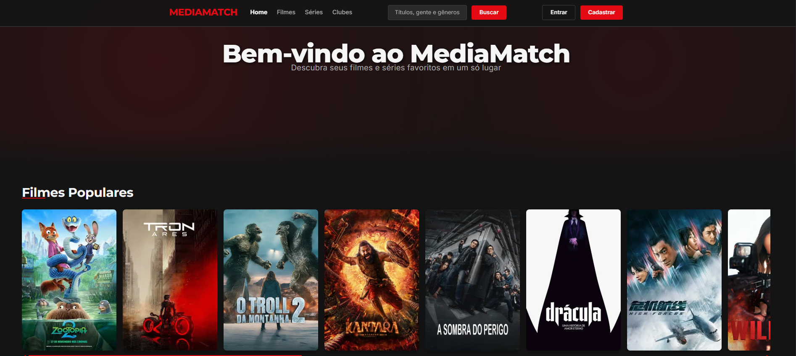
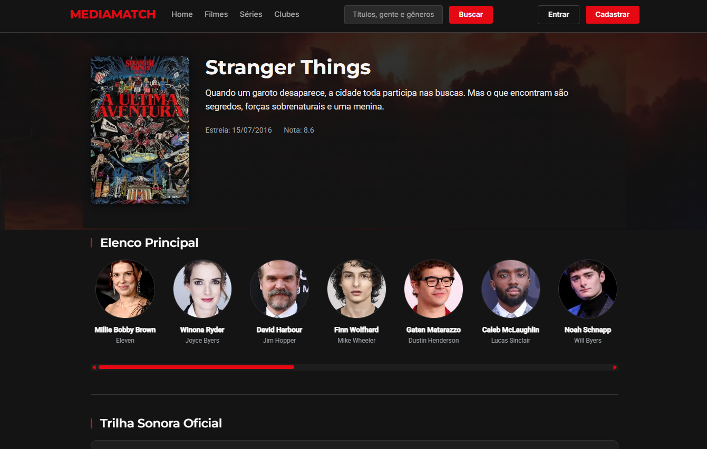
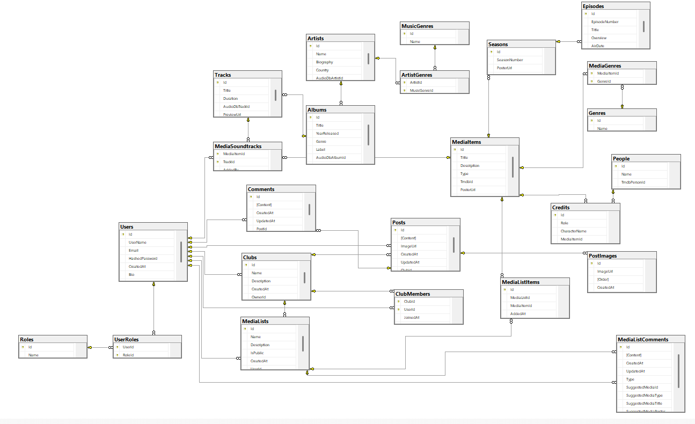

# MediaMatch

MediaMatch e uma plataforma para descobrir filmes, series e trilhas sonoras dos mesmos, reunir usuarios em clubes de midia e organizar listas colaborativas. O projeto integra fontes externas (TMDB, TheAudioDB e Spotify) e oferece autenticacao com JWT, gestao de clubes e interacoes sociais via posts e comentarios.

## Visao geral do projeto
- API ASP.NET Core 8 com Entity Framework Core, SQL Server e documentacao via Swagger
- Camada de servicos para agregacao de trilhas (Spotify + TheAudioDB) e informacoes de midia (TMDB)
- Autenticacao baseada em JWT, controle de papeis e endpoints para clubes, listas, posts e comentarios
- Frontend Angular 21 com Angular Material



## Tecnologias principais
- **Backend:** .NET 8, ASP.NET Core, EF Core, SQL Server, Swagger, JWT
- **Frontend:** Angular 21, Angular Material
- **Integracoes externas:** The Movie Database (TMDB), TheAudioDB, Spotify Web API

## Requisitos
- .NET SDK 8.0+
- SQL Server (Express, LocalDB ou instancia compatível)
- Node.js 20+ e npm 10+
- Ferramenta `dotnet-ef` instalada globalmente (`dotnet tool install --global dotnet-ef`) caso ainda nao esteja presente
- Credenciais Spotify (Client ID e Client Secret) com acesso ao endpoint de client credentials

## Configuracao do backend
```powershell
# Clonar o repositorio
git clone <url-do-repositorio>
cd MediaMatchTP3\MediaMatch

# Entrar na API e restaurar dependencias
cd api
dotnet restore

# Aplicar migracoes para criar o banco de dados
dotnet ef database update
```

### Configurar chaves e secrets
Defina as credenciais do Spotify para liberar a funcionalidade de trilhas sonoras. O projeto já carrega automaticamente um arquivo `api/.env` (ver `Program.cs`); basta mantê-lo com os valores corretos.
Renomeei o .env.example para .env e adicione:

```env
SPOTIFY_CLIENT_ID=seu-client-id
SPOTIFY_CLIENT_SECRET=seu-client-secret
```

Caso a chave nao esteja configurada, os endpoints relacionados a trilhas via Spotify nao funcionarao corretamente.

### Executar a API
```powershell
dotnet run
```
A API inicia em `https://localhost:7016` (HTTP em `http://localhost:5042`) e expone a documentacao Swagger em `/swagger`.

## Configuracao do frontend
Abra um novo terminal na raiz do projeto e execute:
```powershell
cd front\media-match
npm i
npm start
```
O servidor de desenvolvimento Angular fica disponivel em `http://localhost:4200` e utiliza a API rodando em paralelo.

## Estrutura de pastas (resumo)
```
MediaMatch/
├─ api/                 # Backend ASP.NET Core
│  ├─ Controllers/      # Endpoints de autenticacao, clubes, posts etc.
│  ├─ Data/             # DbContext e configuracoes EF Core
│  ├─ DTO/              # Objetos de transferencia de dados
│  ├─ Services/         # Integracoes externas e regras de negocio
│  └─ Middleware/       # Tratamento global de excecoes e autenticacao
└─ front/
   └─ media-match/      # Aplicacao Angular 21
      ├─ src/           # Codigo fonte e componentes
      └─ package.json   # Scripts e dependencias
```

## Troubleshooting
- Valide a string de conexao em `api/appsettings.json` caso o comando `dotnet ef database update` falhe
- Certifique-se de que as variaveis `Spotify:ClientId` e `Spotify:ClientSecret` estao definidas antes de acionar a funcionalidade de trilhas
- Em caso de erros de CORS no frontend, verifique as configuracoes da API para hosts permitidos
